 # Cyclus - Female Health & Wellbeing App  
 
Cyclus seeks to make tracking menstrual cycles, ovulation,
and general health easier by utilizing machine learning techniques with Flask,Python for the
backend and Flutter and Dart for the frontend.

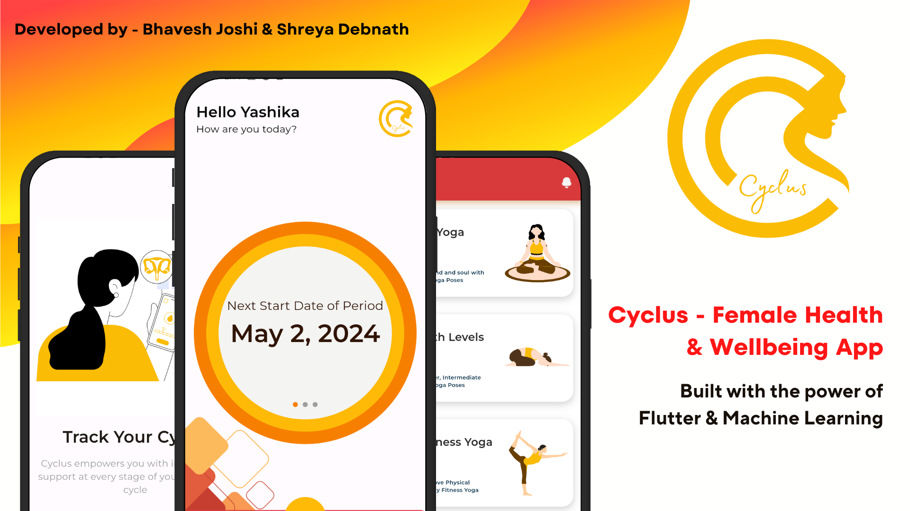

## Screenshots
 
<table border>
     <tr>
        <th style="text-align:center" colspan="3">Onboarding Screens</th>
    </tr>
    <tr>
        <td>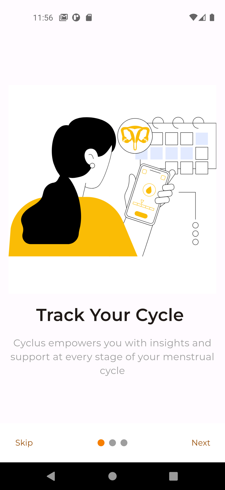</td>
        <td>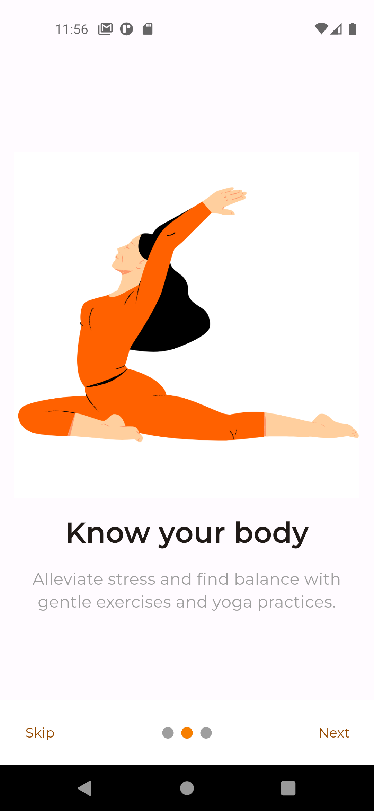</td>
        <td></td>   
    <tr>
</table>

<table border>
     <tr>
        <th style="text-align:center" colspan="3">Registration & Login Screens</th>
    </tr>
    <tr>
        <td></td>
        <td></td>
        <td>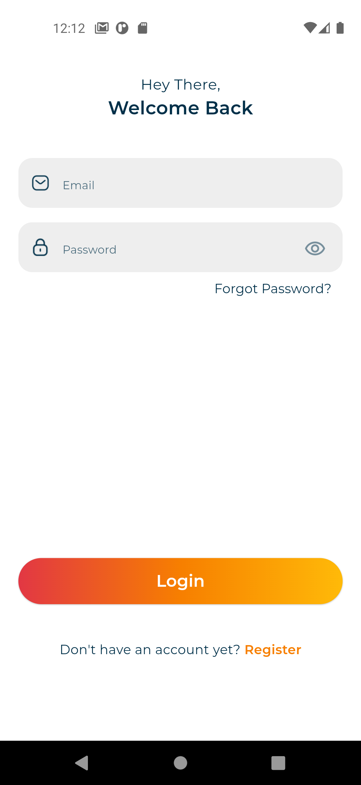</td>
    <tr>
</table>

<table border>
     <tr>
        <th style="text-align:center" colspan="3">User Details for Registration</th>
    </tr>
    <tr>
        <td>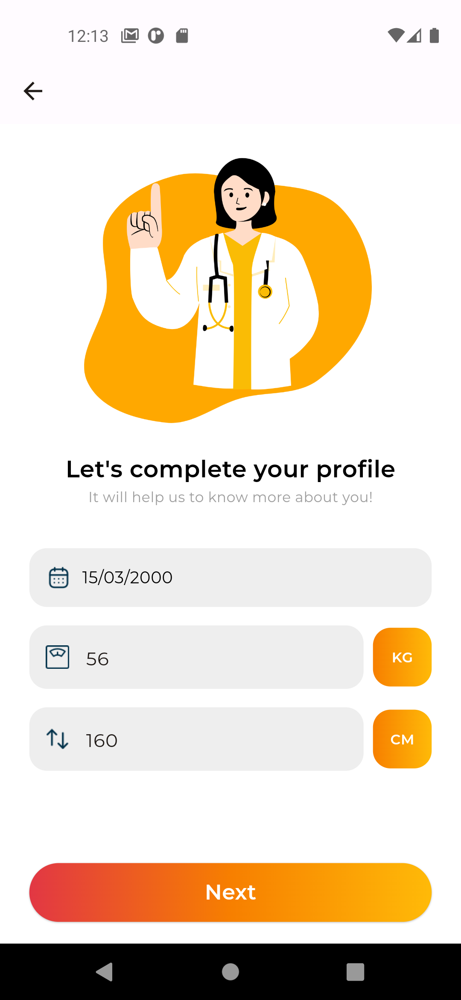</td>
        <td>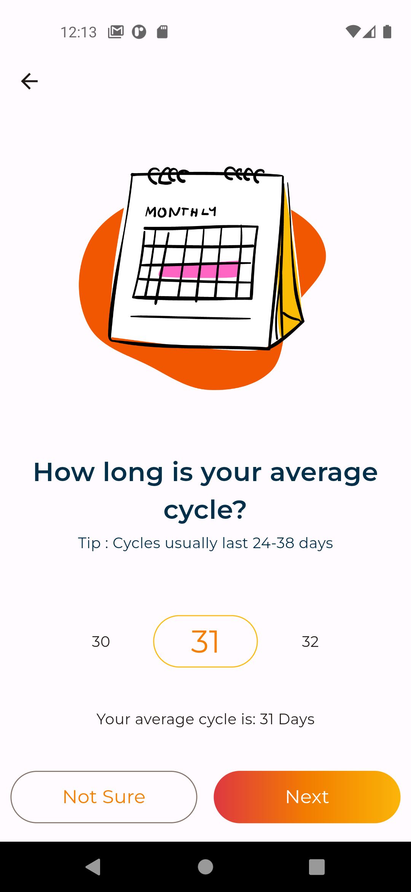</td>
        <td>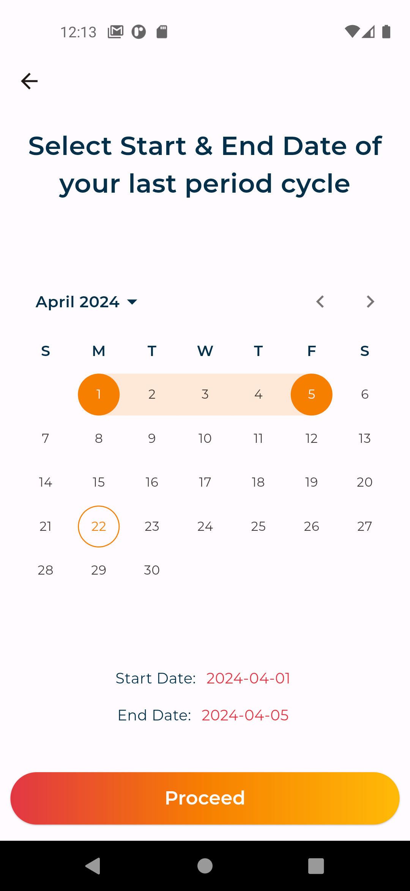</td>
    <tr>
</table>

<table border>
     <tr>
        <th style="text-align:center" colspan="3">App Main Screen (Prediction) & Profile </th>
    </tr>
    <tr>
        <td>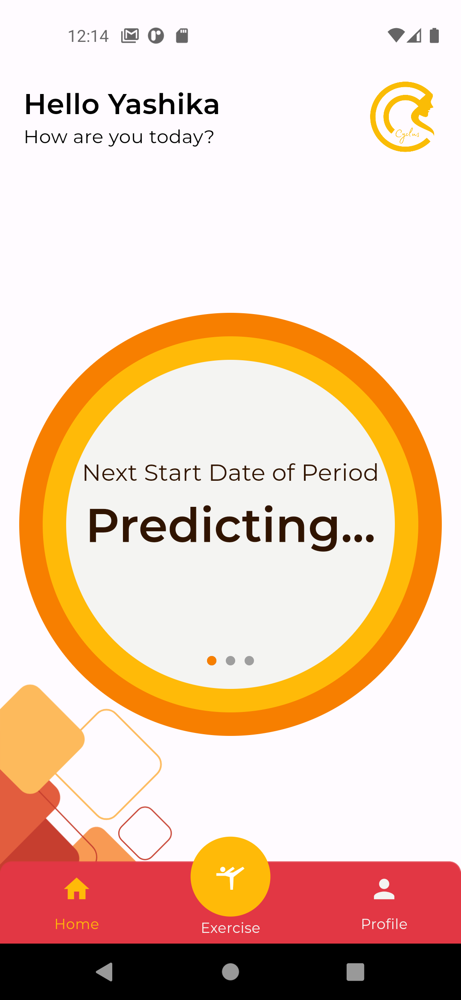</td>
        <td>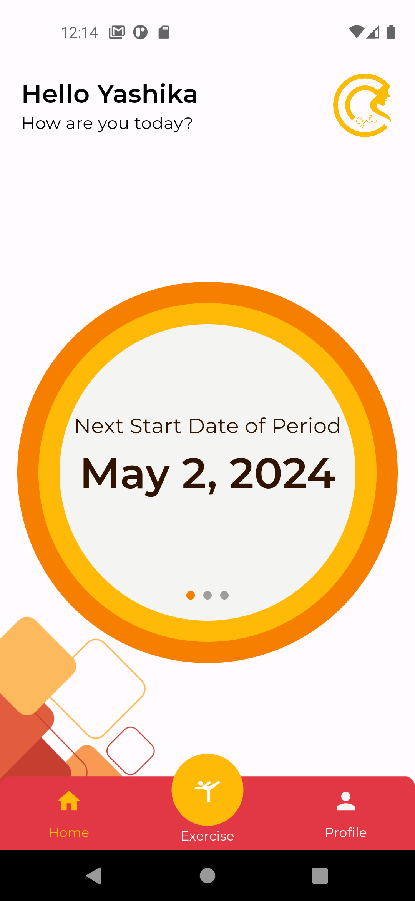</td>
        <td>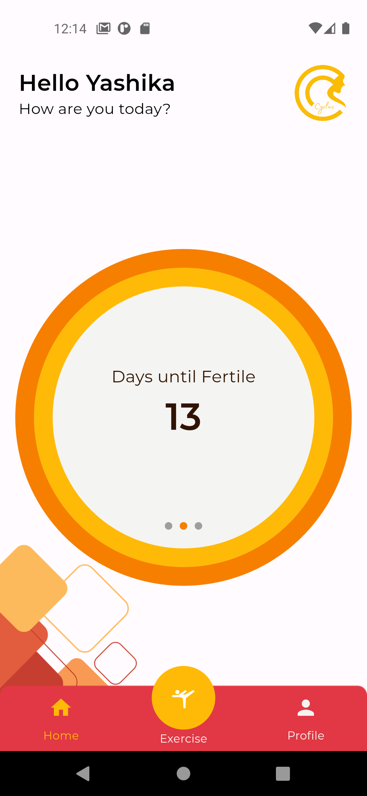</td>
        <td>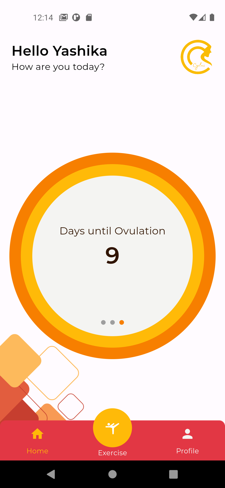</td>
        <td>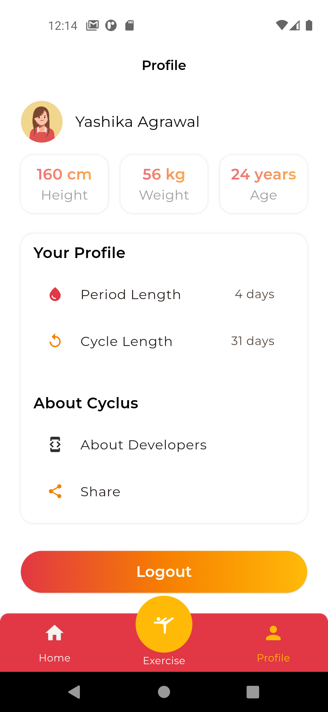</td>
    <tr>
</table>

<table border>
     <tr>
        <th style="text-align:center" colspan="3">Yoga Screens</th>
    </tr>
    <tr>
        <td>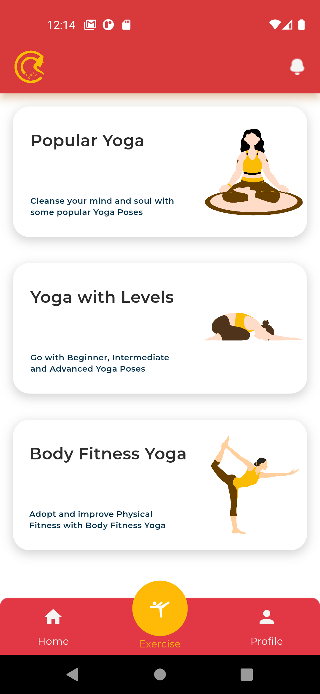</td>
        <td>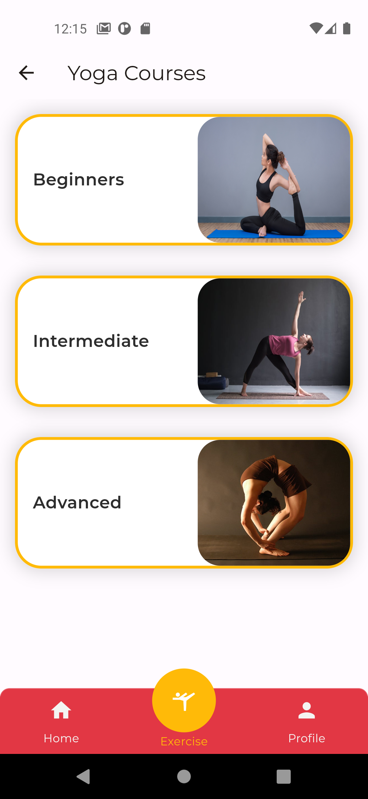</td>
        <td>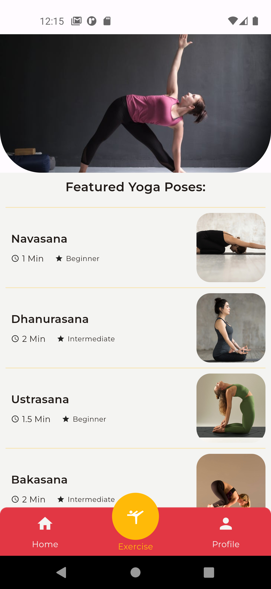</td>
        <td>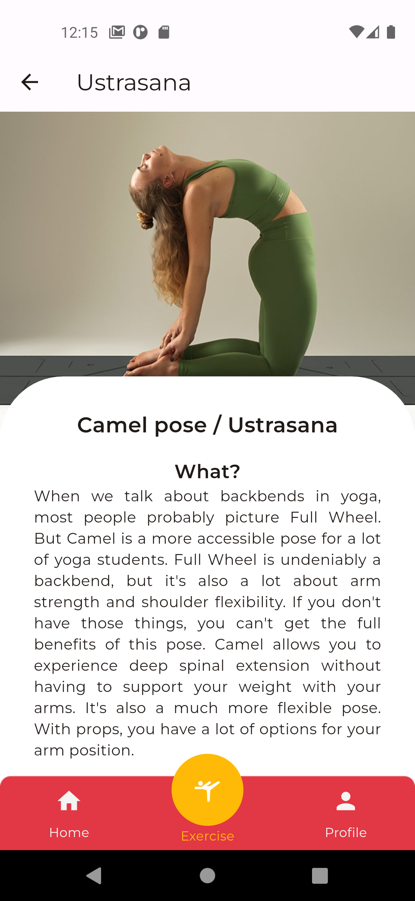</td>
    <tr>
</table>

